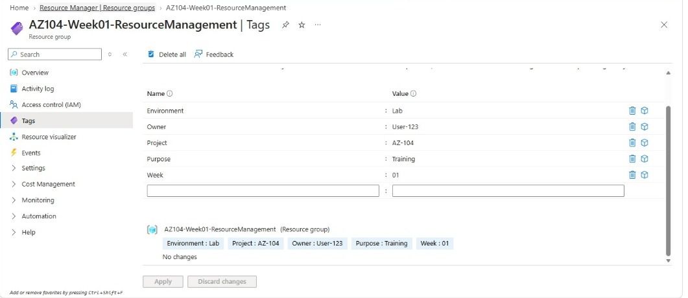
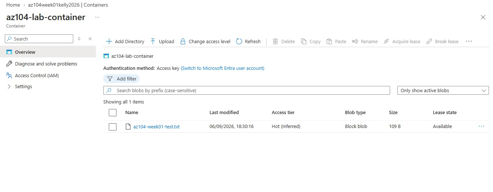
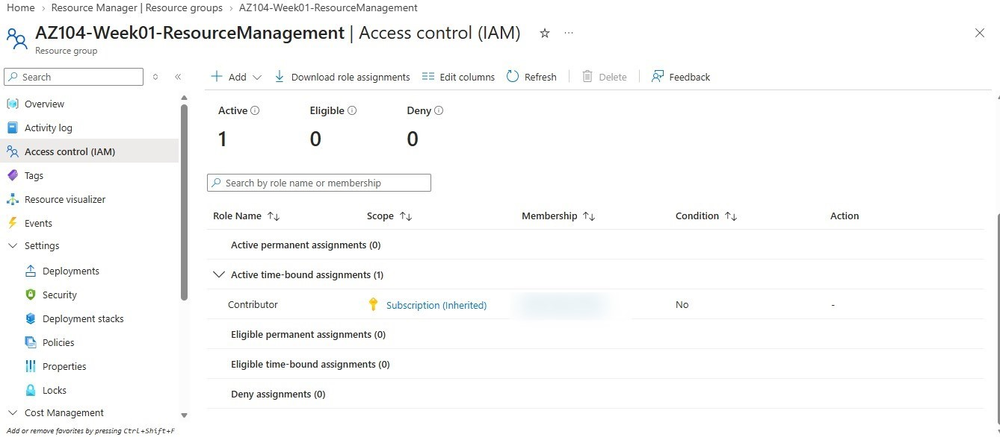
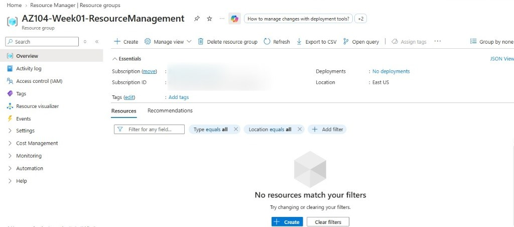
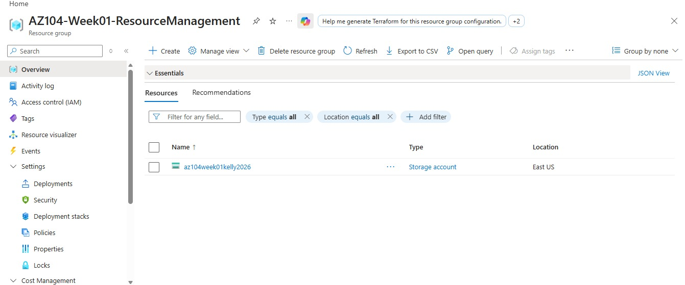
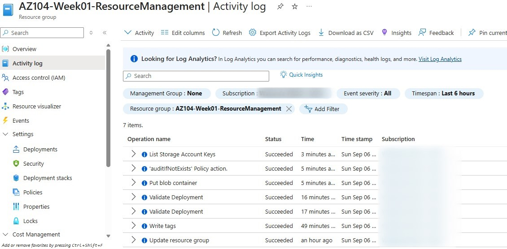

# AZ-104 Week 1 — Azure Resource Management

## 1. Lab Title
**Azure Resource Group Organization & Basic Administration**

## 2. Objective
Practice foundational Azure administration by creating a properly organized Resource Group, deploying a simple storage workload inside it, and exploring the core governance and monitoring tools an Azure Administrator uses day to day: tags, IAM, resource locks, and the Activity Log.

## 3. Scenario
As the starting point of a weekly AZ-104 hands-on portfolio, this lab simulates a common first task for a new Cloud Administrator: standing up a clean, well-labeled Resource Group for a project, deploying a basic resource into it, and confirming that access, auditing, and governance controls behave as expected — all within a **shared Azure environment**, which meant being deliberate about scope and cleanup.

## 4. Azure Services / Concepts Used
- Resource Groups
- Azure Storage Accounts (Blob Storage)
- Blob Containers & Access Levels
- Tags
- Access Control (IAM) / Azure RBAC
- Resource Locks (explored, not applied — see Challenges)
- Activity Log

## 5. Architecture

The diagram distinguishes **deployed resources** (Resource Group → Storage Account → Blob Container → Blob) from **governance/management concepts** (Tags, IAM, Activity Log, Resource Locks) that were applied to or explored on that Resource Group, rather than being resources in their own right.

## Screenshots

**Tags applied to the Resource Group**

**Blob Container detail — test file uploaded**

**Access Control (IAM) — role assignment on the Resource Group**

**Resource Group overview (before deployment)**

**Resource Group overview — Storage Account deployed**

**Activity Log — management operations**

## 6. Implementation Steps
1. Created a dedicated Resource Group, `AZ104-Week01-ResourceManagement`, in East US to contain all lab resources.
2. Applied a set of organizational tags to the Resource Group (`Environment`, `Owner`, `Project`, `Purpose`, `Week`).
3. Attempted to configure a Resource Lock on the Resource Group to practice change-protection controls.
4. Created an Azure Storage Account (`az104week01kelly2026`) inside the Resource Group.
5. Created a Blob Container (`az104-lab-container`) with a **Private** access level.
6. Uploaded a small test file (`az104-week01-test.txt`) to confirm read/write access to the container.
7. Reviewed **Access Control (IAM)** on the Resource Group to see which roles and scopes applied to my account.
8. Reviewed the **Activity Log** to trace the management operations performed during the lab.
9. Deleted the lab resources to keep the shared environment clean.

## 7. Configuration Performed
- Resource Group: `AZ104-Week01-ResourceManagement` (East US)
- Tags: `Environment=Lab`, `Owner=User-123`, `Project=AZ-104`, `Purpose=Training`, `Week=01`
- Storage Account: Standard performance tier, East US
- Blob Container: `az104-lab-container`, Private (no anonymous access)
- Test object uploaded to confirm container functionality

## 8. Important Concepts Learned
- How Resource Groups act as the logical and permission boundary for related resources.
- The practical difference between **tags** (metadata for organization/cost tracking) and **RBAC** (actual access control).
- How Blob Container access levels (Private vs. public) control anonymous read access.
- How to read an Activity Log entry to understand *what* operation ran, *who* (scoped) triggered it, and *when*.
- That IAM role assignments can be inherited from a higher scope (in this case, Contributor inherited from the subscription) rather than assigned directly at the resource group.

## 9. Challenges Encountered
When attempting to configure a **Resource Lock** on the Resource Group, my assigned account did not have sufficient permissions to create or manage locks.

## 10. How the Challenge Was Handled
Rather than attempting to escalate or bypass the permission boundary, I treated this as expected behavior for a shared/managed environment and documented it as a learning point: **least-privilege access boundaries are a normal and important part of real Azure environments**, and recognizing/respecting them is itself part of the Administrator skill set.

## 11. Validation / Testing
- Confirmed the Resource Group displayed the correct tags after applying them.
- Confirmed the Storage Account and Blob Container appeared correctly nested inside the Resource Group.
- Uploaded and verified a test file inside the container to confirm the storage path was functional end-to-end.
- Cross-checked the Activity Log to confirm each action (tag write, container creation, deployment validation) was logged as **Succeeded**.

## 12. Cleanup
All lab resources (Storage Account, Blob Container, and the Resource Group itself) were deleted after the lab was completed and validated, in line with keeping the shared Azure environment clean for other users.

## 13. Key Takeaways
- Organizing resources into a purpose-built Resource Group with consistent tagging makes an environment easier to manage, audit, and eventually automate.
- IAM and Resource Locks are separate control planes — one governs *who can act*, the other governs *what actions are allowed regardless of role*.
- The Activity Log is a first stop for troubleshooting "what changed" in an environment.
- Working in a shared environment reinforces good habits early: scoped naming, tagging, and prompt cleanup.

---
*This lab was completed as part of a self-directed, hands-on AZ-104 study portfolio. It reflects a learning environment, not production experience.*
